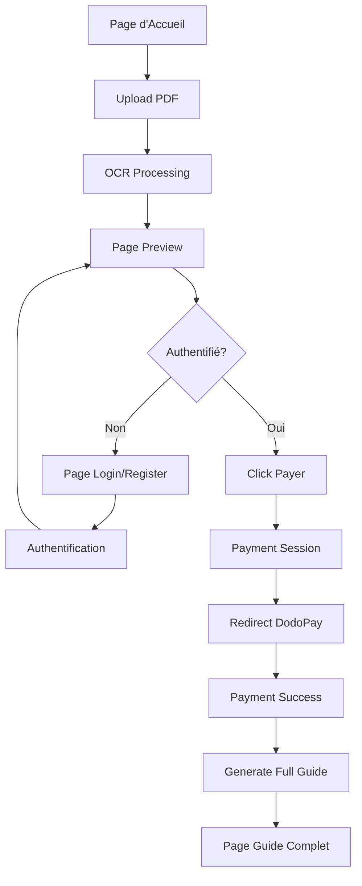

# 📚 Guides.ai - User Flow Documentation

## 📋 Table des Matières

1. [Vue d'Ensemble du Projet](#vue-densemble-du-projet)
2. [Flow UI/UX Complet](#flow-uiux-complet)
3. [Pages & Composants](#pages--composants)
4. [Expérience Utilisateur](#expérience-utilisateur)
5. [Responsive Design](#responsive-design)
6. [Micro-interactions](#micro-interactions)

---

## 🎯 Vue d'Ensemble du Projet

**Guides.ai** est une plateforme web qui permet aux utilisateurs de transformer des PDF en guides d'installation détaillés grâce à l'IA.

### 🎨 Objectifs Utilisateur
- **Simplicité** : Transformer un PDF en guide en quelques clics
- **Transparence** : Prévisualiser gratuitement avant d'acheter
- **Confiance** : Processus de paiement sécurisé
- **Accessibilité** : Guides disponibles sur tous les appareils

### 🎨 Thème Visuel
- **Palette** : Moderne, épurée avec accents bleus
- **Typography** : Inter, claire et lisible
- **Icons** : Lucide React
- **Animations** : Subtiles et fluides

---

## 🔄 Flow UI/UX Complet

### **Flow Principal**


### **Étapes Détaillées**

#### Étape 1 : **Saisie OCR**
1. User arrive sur homepage
2. Colle URL PDF ou upload fichier
3. Clique "Analyser"
4. Loading spinner (2-3 secondes)
5. Redirection automatique vers preview

#### Étape 2 : **Preview**
1. Affichage preview 3-4 étapes
2. Prix clairement affiché (3.99€)
3. CTA "Payer et débloquer"
4. Si non authentifié → redirection login

#### Étape 3 : **Authentification**
1. Login avec email/password
2. Ou création de compte
3. Stockage session utilisateur
4. Redirection automatique vers preview

#### Étape 4 : **Paiement**
1. Click sur "Payer"
2. Redirection vers page paiement externe
3. User effectue le paiement
4. Redirect vers Paiement success

#### Étape 5 : **Affiche du guide complet**
1. Page success affiche confirmation
2. Click "Voir le guide complet"
3. Loading (3-5 secondes)
4. Redirect vers guide complet

#### Étape 6 : **Accès Guide**
1. Affichage guide complet
2. Navigation entre étapes sous forme de carousel (suivant & précédent)
3. Options : télécharger, partager, noter
4. Accès depuis dashboard

---

## 📱 Pages & Composants

### **1. Page d'Accueil** (`/`)
**Objectif** : Point d'entrée principal pour l'OCR

**Éléments UI**
- Hero section avec titre accrocheur
- Formulaire OCR centré et mis en avant
- Features : 3-4 bénéfices clés
- Footer avec liens navigation

**Formulaire OCR**
```tsx
- Input URL PDF (placeholder clair)
- Input Titre (optionnel)
- Bouton "Analyser le document" (CTA principal)
- Loading spinner pendant traitement
- Toast notifications pour feedback
```

**États**
- **Initial** : Formulaire vide, prêt à saisir
- **Loading** : Spinner + message "Analyse en cours..."
- **Success** : Redirection vers preview
- **Error** : Message d'erreur clair

---

### **2. Page Preview** (`/preview/[id]`)
**Objectif** : Afficher la preview et inciter au paiement

**Design**
- Header : Navigation + profil utilisateur
- Preview Card : Mise en valeur du contenu
- Pricing : Affichage clair du prix
- CTA Payment : Bouton prominent
- Trust Elements : Avis, garanties

**Éléments UI**
```tsx
- Titre du guide
- Temps estimé + difficulté
- Matériels requis (icons)
- 3-4 étapes preview
- Prix : 3.99€ (mis en avant)
- Bouton "Payer et débloquer" (vert/bleu)
- Section "Ce que vous obtiendrez"
```

**États**
- **Loading** : Chargement de la preview
- **Preview** : Affichage du contenu
- **Payment Loading** : Spinner sur bouton
- **Authenticated** : Bouton paiement actif
- **Not Authenticated** : Redirection vers login

---

### **3. Page Login** (`/login`)
**Objectif** : Authentifier les utilisateurs

**Design**
- Formulaire centré : Clean et minimaliste
- Social Login : Optionnels (Google, etc.)
- Link Register : "Pas de compte ? S'inscrire"
- Branding : Logo + tagline

**Éléments UI**
```tsx
- Email input (validation)
- Password input (show/hide)
- "Se souvenir de moi" checkbox
- "Mot de passe oublié ?" link
- Bouton "Se connecter" (full width)
- Link vers inscription
```

---

### **4. Page Register** (`/register`)
**Objectif** : Créer de nouveaux comptes

**Design**
- Similaire au login : Cohérence visuelle
- Champs supplémentaires : Confirmation password
- Terms : Checkbox CGU
- Link Login : "Déjà un compte ? Se connecter"

**Éléments UI**
```tsx
- Email input
- Password input
- Confirm password input
- "Accepter les CGU" checkbox
- Bouton "Créer mon compte"
- Link vers login
```

---

### **5. Page Payment Success** (`/payment/success`)
**Objectif** : Confirmer le paiement et générer le guide

**Design**
- Success Animation : Checkmark animé
- Message de confirmation : Clair et positif
- Generate Button : CTA pour obtenir le guide
- Order Details : Récapitulatif

**Éléments UI**
```tsx
- ✅ Icône de succès animée
- "Paiement confirmé !"
- "Générer votre guide complet"
- Bouton "Générer le guide" (prominent)
- Loading pendant génération
- Redirection automatique vers guide
```

---

### **6. Page Guide Complet** (`/guides/[id]`)
**Objectif** : Afficher le guide complet payant

**Design**
- Header : Titre + métadonnées
- Navigation : Sommaire sticky
- Content : Guide détaillé
- Actions : Télécharger, partager, noter

**Éléments UI**
```tsx
- Titre H1 + badge "Premium"
- Métadonnées (temps, difficulté, date)
- Sommaire navigable
- Étapes détaillées avec images
- Section "Outils nécessaires"
- "Dépannage" avec Q/R
- Rating system (étoiles)
- Actions flottantes (download, share)
```

---

## 🎨 Expérience Utilisateur

### **Friction Reduction**
- Auto-focus sur premier champ
- Auto-redirect après succès
- Remember form inputs
- Smart defaults

### **Trust Building**
- Security badges
- Social proof
- Clear pricing
- Money-back guarantee

### **Conversion Optimization**
- Single CTA per page
- Urgency indicators
- Progress indicators
- Value proposition

### **User Journey Mapping**

**First Time User**
```
Discovery → Interest → Consideration → Conversion → Retention
    ↓           ↓           ↓           ↓           ↓
 Homepage → Preview → Register → Payment → Guide
```

**Returning User**
```
Login → Dashboard → New Guide → Payment → Library
  ↓        ↓         ↓          ↓        ↓
 Auth → History → OCR Flow → Checkout → Access
```

---

## 📱 Responsive Design

### **Desktop (>1024px)**
- **Layout** : 12-column grid
- **Navigation** : Header horizontal
- **Forms** : Max-width 500px, centrés
- **Cards** : Grid 2-3 colonnes

### **Tablet (768px-1024px)**
- **Layout** : Adaptive grid
- **Navigation** : Header simplifié
- **Forms** : Full-width avec padding
- **Cards** : Grid 2 colonnes

### **Mobile (<768px)**
- **Layout** : Single column
- **Navigation** : Hamburger menu
- **Forms** : Full-width
- **Cards** : Single column
- **CTAs** : Sticky bottom buttons

---

## ✨ Micro-interactions

### **Hover Effects**
- Buttons : Scale + shadow
- Cards : Elevation change
- Links : Underline animation
- Inputs : Border color change

### **Transitions**
- Page transitions : Fade/slide
- Modal : Scale + backdrop
- Toast : Slide from top
- Loading : Smooth spinners

### **Feedback**
- Button press : Ripple effect
- Form validation : Shake animation
- Success : Bounce animation
- Error : Vibrate effect

### **Loading States**
```tsx
// Spinners
- Button spinner (pendant OCR/paiement)
- Page skeleton (pendant chargement)
- Progress bar (génération guide)

// Messages
- "Analyse en cours..."
- "Connexion en cours..."
- "Paiement en cours..."
- "Génération du guide..."
```

### **Error States**
```tsx
// Toast notifications
- "URL invalide"
- "Erreur de connexion"
- "Paiement échoué"
- "Erreur génération guide"

// Inline errors
- Validation messages
- Field-specific errors
- Network error indicators
```

### **Success States**
```tsx
// Confirmations
- "Guide généré avec succès !"
- "Paiement confirmé"
- "Compte créé"

// Animations
- Checkmark animations
- Confetti (payment success)
- Smooth transitions
```

---

## ♿ Accessibilité

### **Navigation Clavier**
- Tab order logique
- Focus indicators visibles
- Skip to content links
- Keyboard shortcuts

### **Screen Readers**
- Semantic HTML5
- ARIA labels
- Alt text pour images
- Heading hierarchy

### **Contrastes et Tailles**
- WCAG AA compliance
- Text sizes >= 16px
- High contrast mode
- Touch targets >= 44px

---

## 🎯 Conclusion

Ce flow UI/UX est conçu pour :
- **Simplicité** : Minimum de friction
- **Clarté** : Chaque étape est évidente
- **Confiance** : Éléments de réassurance
- **Conversion** : Optimisé pour le paiement
- **Accessibilité** : Utilisable par tous

L'application guide l'utilisateur naturellement du simple upload PDF jusqu'à l'obtention d'un guide complet payant, avec des points de friction minimisés et une expérience fluide sur tous les appareils.

---

**Dernière mise à jour** : Février 2026  
**Version** : 1.0.0  
**Focus** : User Flow & Experience
